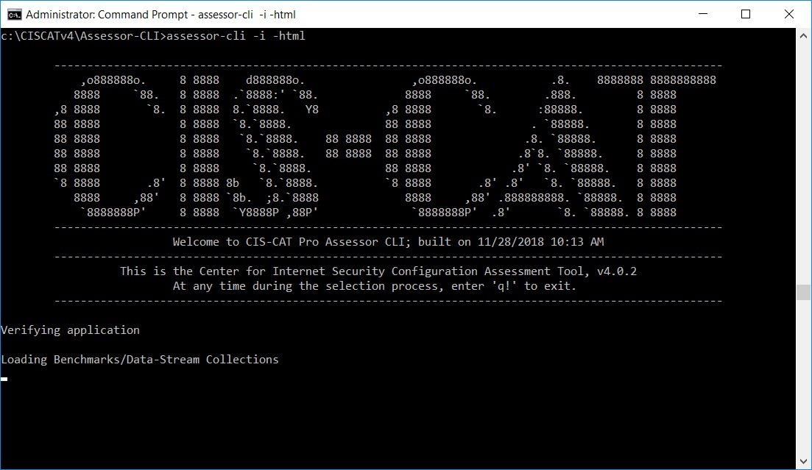

1. Download CIS-CAT
2. Execute CIS-CAT against a specified target system using a CIS Benchmark
3. Review the results from the CIS-CAT Assessment Report
4. Analyze what failed recommendations should be remediated to align with organizational needs
5. Begin to remediate
6. Maintain routine scanning, reviewing and remediation schedule

# Download CIS-CAT Pro Assessor #

There are two versions of CIS-CAT:

- CIS-CAT Pro Assessor v3, performs assessments over local or a shared internal network
- CIS-CAT Pro Assessor v4, performs assessments remotely, local, shared internal network
	- See the [CIS-CAT Pro v4 Documentation](https://ccpa-docs.readthedocs.io/en/latest/) for more information about the workflows available for each operating system or technology

At some time in the future, CIS-CAT Pro v3 will no longer be supported.  While it will be supported with new benchmark content for the foreseeable future, CIS focuses development resources on CIS-CAT Pro v4.  As a new member, you should start using v4. We are currently working to update v4 with the required functionality before officially announcing v3 as End of Life.

The latest versions of CIS-CAT are available in the CIS WorkBench Downloads.  Enter "CIS-CAT" in the tags field and click "Search".  All the latest versions of CIS-CAT will be pinned to the top of the list.

Documentation for CIS-CAT Pro v3 will be available in the /docs folder of the download bundle.

Documentation for CIS-CAT Pro v4 is available here: [CIS-CAT Pro v4 Documentation](https://ccpa-docs.readthedocs.io/en/latest/)

Once you have downloaded your chosen bundle, extract it.

**NOTE:** All versions of CIS-CAT require Java to be installed on the CIS-CAT host machine  or a shared network access.  In the case of v4, using remote sessions, java only needs to be installed on the system where v4 is installed,  not on the remote target systems being assessed. See [CIS-CAT Pro v4 Documentation](https://ccpa-docs.readthedocs.io/en/latest/) for specific information on Java.

##Test Level2##
dfsfsdf

###Test Level 3###

#### CIS-CAT v4 ####

The most basic use case of CIS-CAT v4 is running on the local system using interactive mode.  At a command prompt or shell navigate to the directory you extracted CIS-CAT v4 and run the command: assessor-cli -i -html

The '-i' option will run CIS-CAT in interactive mode.  This will allow you to choose a benchmark and profile manually from the command line interface

The '-html' option will tell CIS-CAT to create the HTML version of the report, which is the most human readable form of the report.

In addition,  CIS-CAT will create a report in ARF,  Asset Reporting Format, which can be imported into CIS-CAT Pro Dashboard for further reporting capabilities.

**NOTE:**  CIS-CAT v4 needs to run as an administrator.

##### Choose the Applicable Benchmark to Run Against #####

The list presented in interactive mode is the list of available benchmarks.  Select the number of the benchmark that corresponds to the operating system you are running CIS-CAT v4 on.

##### Choose the Applicable Profile to Run Against #####
Choose the run against the profile level that aligns with your organizational policies.

We recommend starting with the Level 1 profile. It is designed to have a low risk impact on system performance and functionality.

Once you've selected the profile CIS-CAT will scan the local system against the benchmark and profile you selected.  When it completes, it will generate

#### Understanding your CIS-CAT Pro Assessor Assessment Report ####

[Report Video](https://www.youtube.com/watch?v=cFECOymK57o)

**Cover Page**

Viewing the HTML report output of an assessment, the “cover page” will display the “Security Configuration Assessment Report” for the machine which was assessed.

The sub-title area displays the selected benchmark and its version number, the profile selected, and the date and time the assessment was performed.

**Report Summary Page**

The “Summary” table of contents displays the high-level sections containing the list of recommendations which were assessed and the number of tests which passed, failed, or generated an error, as well as a relative compliance score derived from the percent of recommendations that passed, over the percent of recommendations that were assessed.

**Profile Level Notation**

The “Profiles” listing displays the name and description of all profiles contained in benchmark. The highlighted row indicates which profile we just selected.

**Assessment Results Table of Contents**

The “Assessment Results” table of contents contains the detailed listing of every recommendation assessed when executing CIS-CAT Pro Assessor. Each evaluated recommendation listing displays the  benchmark section number, title, and overall Pass/Fail result status.

Each recommendation title is a hyperlink, that, when clicked, navigates the user to that specific section of the HTML report.

**Recommendation Sections**

When viewing the detailed information for an evaluated recommendation, note that the section number, title, description, rationale, remediation, impact, and references mirror the information contained in the PDF version of the CIS Benchmark.

The “Assessment” section displays the evidence collected from the target system which was used to determine the compliance to the benchmark recommendation. Clicking the “More” link adjacent to the “assessment” information displays this evidence: detailing what CIS-CAT Pro Assessor expected to collect, along with the actual information collected from the target system.

The individual recommendation sections should give you all the information you need to determine what to do with failing recommendations.

#### What if my CIS-CAT report is not 100% compliant? ####

All of the profiles, and recommendations included in the profiles, are recommendations by the CIS community.  As such it is best practice guidance provided by: subject matter experts, the technology vendor (ex. Microsoft employees for the Windows Benchmarks), and security experts from around the world.  Although the benchmarks represent the best practice advice of this diverse community of experts, it is still just guidance and not entirely applicable to every organization or every technical environment within an organization.

The decision on what CIS recommendations to implement must be based on the individual organizations own security policies and procedures.  Each individual organization implementing CIS recommendations must decide, test and implement the recommendations to see if they negatively effect the specific environment they are hardening. If your organization can implement all of the security settings without negatively impacting your business applications or end users, then they should all be implemented. However, implementing every security setting will be unrealistic for some organizations.  

Although the CIS-CAT Pro Dashboard (described below) has features to help you perform this analysis and make decisions as to what recommendations you want to implement,  much of this work has to be done by people within the organization.  Once this analysis is complete you need to formulate an implementation plan for remediating the failures.
