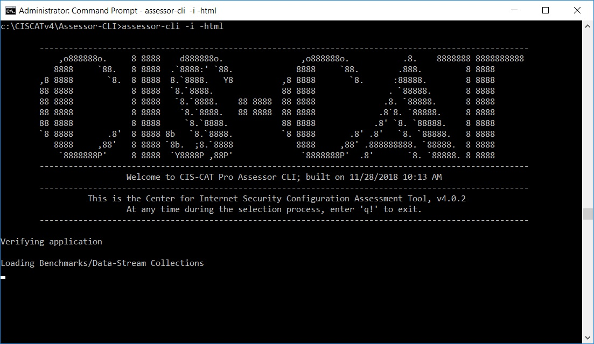

1. Download CIS-CAT
2. Execute CIS-CAT against a specified target system using a CIS Benchmark
3. Review the results from the CIS-CAT Assessment Report
4. Analyze what failed recommendations should be remediated to align with organizational needs
5. Begin to remediate
6. Maintain routine scanning, reviewing and remediation schedule

#### Download CIS-CAT Pro Assessor ####

There are two versions of CIS-CAT:

- CIS-CAT Pro Assessor v3, performs assessments over local or a shared internal network
- CIS-CAT Pro Assessor v4, performs assessments remotely on some systems.

CIS-CAT Pro v3 and v4 are enterprise-level tools available to CIS SecureSuite Members.  CIS-CAT Pro v3 will end support and distribution mid to late 2019.  While it will be supported with new benchmark content for the foreseeable future, CIS focuses development resources on CIS-CAT Pro v4.  As a new member, you should start using v4.

The latest versions of CIS-CAT are available in the CIS WorkBench Downloads.  Enter "CIS-CAT" in the tags field and click "Search".  All the latest versions of CIS-CAT will be pinned to the top of the list.

Documentation for CIS-CAT Pro v3 will be available in the /docs folder of the download bundle.

Documentation for CIS-CAT Pro v4 is available here: [CIS-CAT Pro v4 Documentation](https://ccpa-docs.readthedocs.io/en/latest/)

Once you have downloaded your chosen bundle, extract it.

**NOTE:** All versions of CIS-CAT require Java to be installed on the machine where the assessments will be running.  In the case of v4, using remote sessions, java only needs to be installed on the system where v4 is installed,  not on the remote target systems being assessed.

#### CIS-CAT v4 ####

The most basic use case of CIS-CAT v4 is running on the local system using interactive mode.  At a command prompt or shell navigate to the directory you extracted CIS-CAT v4 and run the command: assessor-cli -i -html

The '-i' option will run CIS-CAT in interactive mode.  This will allow you to choose a benchmark and profile manually from the command line interface

The '-html' option will tell CIS-CAT to create the HTML version of the report, which is the most human readable form of the report.

In addition,  CIS-CAT will create a report in ARF,  Asset Reporting Format, which can be imported into CIS-CAT Pro Dashboard for further reporting capabilities.

**NOTE:**  CIS-CAT v4 needs to run as an administrator.

##### Choose the Applicable Benchmark to Run Against #####

The list presented in interactive mode is the list of available benchmarks.  Select the number of the benchmark that corresponds to the operating system you are running CIS-CAT v4 on.

##### Choose the Applicable Profile to Run Against #####
Choose the run against the profile level that aligns with your organizational policies.

We recommend starting with the Level 1 profile. It is designed to have a low risk impact on system performance and functionality.

Once you've selected the profile CIS-CAT will scan the local system against the benchmark and profile you selected.  When it completes, it will generate

#### Understanding your CIS-CAT Pro Assessor Assessment Report ####

[Report Video](https://www.youtube.com/watch?v=cFECOymK57o)

**Cover Page**

Viewing the HTML report output of an assessment, the “cover page” will display the “Security Configuration Assessment Report” for the machine which was assessed.

The sub-title area displays the selected benchmark and its version number, the profile selected, and the date and time the assessment was performed.

**Report Summary Page**

The “Summary” table of contents displays the high-level sections containing the list of recommendations which were assessed and the number of tests which passed, failed, or generated an error, as well as a relative compliance score derived from the percent of recommendations that passed, over the percent of recommendations that were assessed.

**Profile Level Notation**

The “Profiles” listing displays the name and description of all profiles contained in benchmark. The highlighted row indicates which profile we just selected.

**Assessment Results Table of Contents**

The “Assessment Results” table of contents contains the detailed listing of every recommendation assessed when executing CIS-CAT Pro Assessor. Each evaluated recommendation listing displays the  benchmark section number, title, and overall Pass/Fail result status.

Each recommendation title is a hyperlink, that, when clicked, navigates the user to that specific section of the HTML report.

**Recommendation Sections**

When viewing the detailed information for an evaluated recommendation, note that the section number, title, description, rationale, remediation, impact, and references mirror the information contained in the PDF version of the CIS Benchmark.

The “Assessment” section displays the evidence collected from the target system which was used to determine the compliance to the benchmark recommendation. Clicking the “More” link adjacent to the “assessment” information displays this evidence: detailing what CIS-CAT Pro Assessor expected to collect, along with the actual information collected from the target system.

The individual recommendation sections should give you all the information you need to determine what to do with failing recommendations.

#### What if my CIS-CAT report is not 100% compliant? ####

All of the profiles, and recommendations included in the profiles, are recommendations by the CIS community.  As such it is best practice guidance provided by: subject matter experts, the technology vendor (ex. Microsoft employees for the Windows Benchmarks), and security experts from around the world.  Although the benchmarks represent the best practice advice of this diverse community of experts, it is still just guidance and not entirely applicable to every organization or every technical environment within an organization.

The decision on what CIS recommendations to implement must be based on the individual organizations own security policies and procedures.  Each individual organization implementing CIS recommendations must decide, test and implement the recommendations to see if they negatively effect the specific environment they are hardening. If your organization can implement all of the security settings without negatively impacting your business applications or end users, then they should all be implemented. However, implementing every security setting will be unrealistic for some organizations.  

Although the CIS-CAT Pro Dashboard (described below) has features to help you perform this analysis and make decisions as to what recommendations you want to implement,  much of this work has to be done by people within the organization.  Once this analysis is complete you need to formulate an implementation plan for remediating the failures.

#### Remediation Kits ####

CIS offers Remediation Kits for certain technologies to assist in the automation of hardening systems. The Remediation Kit is designed to cover the majority of the benchmark settings. The remediation kits can be downloaded from CIS WorkBench, in the downloads section.  Search for the technology you are hardening and download the remediation kit bundle.

For Windows technologies, Remediation Kits take the form of Group Policy Objects (GPOs). The Remediation Kits are zip files that contain a GPO for each profile within the corresponding CIS Benchmark. These GPOs are intended to be imported into the organization’s group policy management console and pushed out to machines in order to meet compliance with the CIS Benchmark. For additional information, please reference the Read Me document contained within each Remediation Kit.  The Remediation Kits for UNIX and LINUX environments are basic shell scripts that can be run from the machine or through another organizationally-approved tool.

These templates or scripts should be modified to align with your organization’s defined policies.  Prior to applying a remediation kit to your test environment, you need to edit the GPO or shell script to only implement the recommendations that you decided to implement in your analysis of the Assessment Results.  Editing of the windows Group Policy Objects or the Linux/Unix shell scripts should be done by a system administrator that is familiar with those technologies.  The system administrator should work with the security policy creator to make sure that the templates match the recommendations the organization decided to implement.

#### Manual Remediation ####

Another option for increasing compliance is through manual remediation.  The recommendation sections of the Assessment Results report contains a remediation segment.  This information is all you need to manually alter the configuration of the target to comply with the CIS Recommendation.  This can be a registry setting or a group policy setting in windows.  

A common workflow for manual remediation is for security policy authors to work with system administrators.  Together they can review the remediations that the security policy author wants to address.  The system adminstrator can choose recommendations or batches of recommendations that can be implemented and tested.  Doing this in smaller batches minimizes risk and slowly brings the target systems into compliance with the CIS Benchmark.

A tool to assist in this process is the Remediation Report in the CIS-CAT Pro Dashboard.  This report is specifically designed to show just the failing recommendations for a specific target system and benchmark.  The report shows the name of the recommendation and the remediation steps from the full Assessment Result.  This report can be given to an operator to help them manually remediate the failures.

#### Exceptions ####

After a CIS-CAT report is produced and all applicable security recommendations have been implemented according to your organization’s requirements, it is recommended to include an exception report to document the justification as to why some recommendations were not applied. CIS-CAT Pro users may also customize these recommendations to meet organizational requirements by using the tailoring functionality available through CIS WorkBench or by manually altering content in the XCCDF file of a particular CIS Benchmark.

#### What if certain recommendations within a benchmark does not align with my company policy and procedure? ####
Now you've reviewed the recommendations in which your system is not complying with CIS recommendations,  you've remediated the recommendations that fit with your organizations security policy and needs, and you still have failing recommendations that you do not plan to implement.  What now?  There are two paths you can chose to increase compliance after you've decided not to remediate more recommendations:  creating exceptions or an exceptions document or tailoring the CIS content.

**Create an Exceptions Document**
One way to track differences between CIS recommendations and your organizations security policy is to create an exceptions document to track any recommendations do not align with your security policy. The exception should list what target systems the exception applies to, the recommendation number and title and the rationale as to why that recommendation cannot be applied in your environment.

Exceptions are a good way to track this information for organizations that are being audited for CIS compliance.  Exceptions recorded as described usually provide the documentation needed to show that an organization has at least considered a recommendation,  decided not to implement the configuration, and provided a reason for there decision.

**Customize CIS-CAT Content**

 Tailoring CIS content to match your organizations security policy is another valid route to increasing compliance scores and dealing with recommendations you do not intend to implement.  Customization of a benchmark could range from turning on or off a recommendation or tailoring a recommendation to properly align with your organization, such as password length.  These customized security policies provide a personalized organizational policy that you can expect 100% compliance with.

Alterations of CIS-CAT Pro content can be made through the tailoring functionality within CIS WorkBench.

**brief description of tailoring needed**

**Create video tutorial on using tailoring functionality in WorkBench**

Modifications to the content can also be completed manually in the XML content such as the XCCDF or OVAL files in the Benchmarks folder of the CIS-CAT Pro Assessor. Upon saving the file with the alterations, the assessment will then run against the new modifications and the CIS-CAT report will produce results in correspondence with the changes made.

[Disabling a Recommendation Video](https://www.youtube.com/watch?v=eIEtWFpEAZE)

[Modifying a Recommendation Video](https://www.youtube.com/watch?v=7iO877jX9IM)

#### CIS-CAT Pro Dashboard####

The CIS-CAT Pro Dashboard provides some additional graphs and reports that can assist organizations in making CIS compliance decisions.  The dashboard shows graphs of the organizations  compliance with CIS Benchmarks over time.  The graphs can be used to drill down to individual Assessment Reports that are causing lower compliance scores so that the recommendations there in can be remediated or excepted or tailored depending on the organizations own personal security policy.

These graphs can also be used to monitor the organizations performance over time.  Once you've complete the initial work of remediating, excepting, and tailoring the content, you can then monitor the continued compliance with your custom security policy.

The dashboard also has functionality to facilitate the recording of exceptions at an organizational level, or at a target system level.  Instead of recording your exceptions in a document, you can record them in the Dashboard tool, then export reports of your exceptions for auditors to view.

**Download CCDP Installer**

https://www.youtube.com/watch?v=YEcZHhdUgNY

**CCPD Deployment Guide**

https://cis-cat-pro-dashboard.readthedocs.io/en/stable/source/Assessor%20Deployment%20Guide/#cis-cat-pro-assessor-deployment-guide

**Link to deployment guide or incorporate content from guide – or both**

how to import results, how to export results, tagging features, how to make an exception, control intersection - link users to what cis controls are - how are they related to cis benchmarks in a familial way?

Can have mini – 1 minute videos on certain critical areas users have questions about (tagging, creating exceptions, drilling down to the assessment report, etc.)

[Create Exceptions in Dashboard]("https://cis-cat-pro-dashboard.readthedocs.io/en/stable/source/Dashboard%20User's%20Guide/#exceptions")
